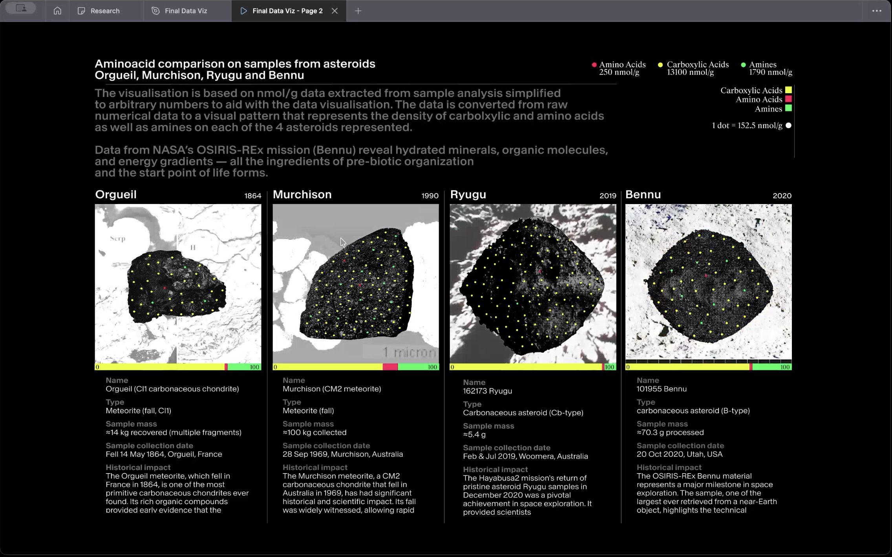
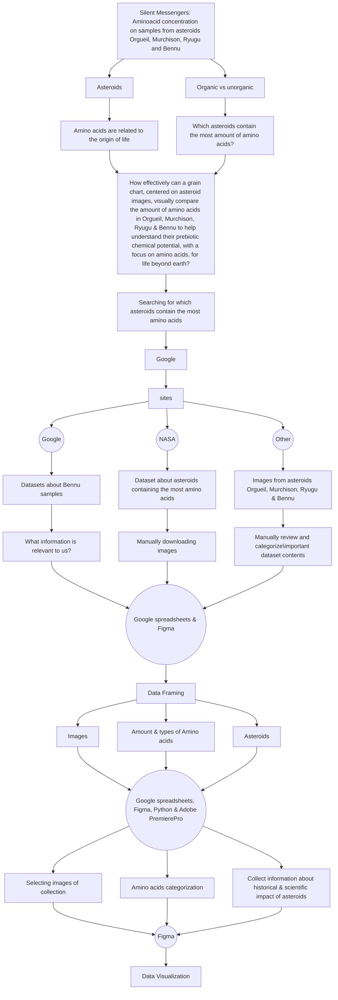

### DDD-2025-Group 08
Ruben Bähler; Riccardo Assirelli; Lynn Germiquet
# Silent Messengers: Amino acid concentration on samples from asteroids Orgueil, Murchison, Ryugu and Bennu

### Visualisation

Link to visualisation: https://vimeo.com/1140051617?fl=pl&fe=sh

### Abstract
The visualisation is based on nmol/g data extracted from sample analysis simplified 
to arbitrary numbers to aid with the data visualisation. The data is converted from raw numerical data to a visual pattern that represents the density of carbolxylic and amino acids as well as amines on each of the 4 asteroids represented.

Data from NASA’s OSIRIS-REx mission (Bennu) reveal hydrated minerals, organic molecules, and energy gradients — all the ingredients of pre-biotic organization 
and the start point of life forms.

### Protocol Diagram

### What topic does the project address?
The project explores how amino acids are distributed in asteroid and meteorite samples to better understand the origins of organic matter in the solar system, and potentially the origins of life.

### What data have you considered?
We used two main types of data:
1. Images of asteroid and meteorite samples
* High-resolution images of the four samples:
* Orgueil
* Murchison
* Ryugu
* Bennu
These images served as the base layer for visualizing where amino acids were detected across each sample.

2. Datasets of amino-acid concentrations
We used quantitative datasets showing the concentration and spatial distribution of various amino acids within each sample.
These datasets allowed us to:
* Plot points directly on the sample images
* Color-code the points based on concentration level
* Compare amino-acid abundance between the different asteroids/meteorites

#### Link to the dataset
https://www.nature.com/articles/s41550-024-02472-9

### What does the visualisation show?
#### 1. Amino-acid concentration maps
Each asteroid image displays a grey silhouette of the sample with colored dots overlaid:
- Yellow, green, and red points indicate relative concentrations of different amino acids.
- The color bar at the bottom (green → yellow → red) represents low to high amino-acid abundance.
- This lets you visually compare how amino acids are distributed across each sample.

#### 2. Historical & scientific context
Below each asteroid, there is scrollable text describing:
- Name & type (e.g., CI1 chondrite, carbonaceous asteroid)
- Sample mass
- Collection date/location
- Historical impact – why each meteorite/asteroid sample is scientifically important
(e.g., Orgueil’s role in early organic-matter studies, Ryugu/Bennu being part of spacecraft sample-return missions).

#### 3. Purpose of the visualization
The graphic is meant to show:
- How organics vary across different primitive solar system bodies.
- How the distribution of amino acids differs between older meteorite falls (Orgueil, Murchison) and recent sample-return missions (Ryugu, Bennu).
- How these findings connect to the study of the origins of life and prebiotic chemistry.
