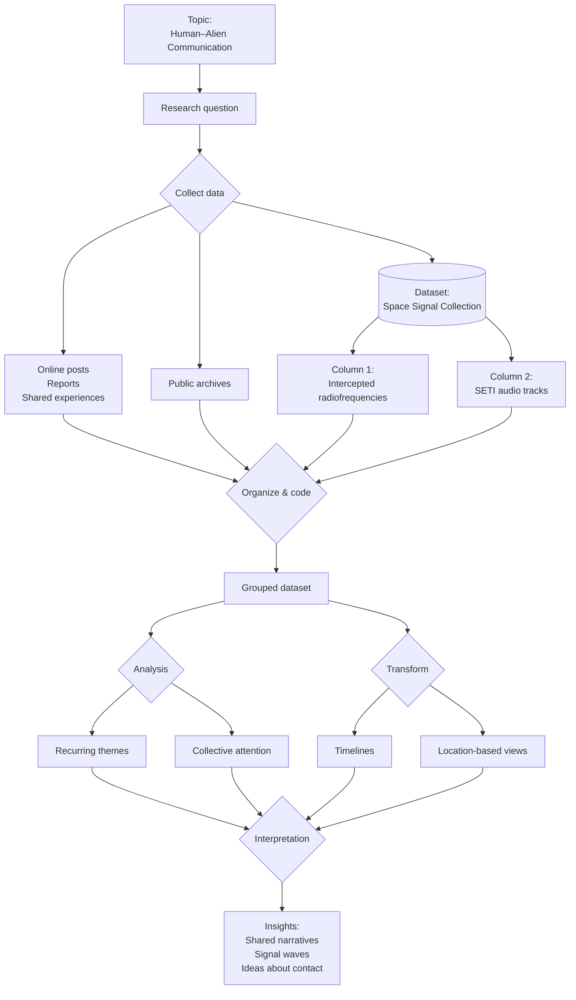

### DDD-2025-Group 08
Ruben Bähler; Riccardo Assirelli; Lynn Germiquet
# Silent Messengers: Aminoacid concentration on samples from asteroids Orgueil, Murchison, Ryugu and Bennu

### Visualisation
[Delete this for final delivery] *Upload here your visualisation. You can use a screenshots, a video/gif (if you need to show the interaction)*

#### Link to the prototype or website (if available)
https://www.jasondavies.com/wordtree/?source=obama.inauguration.2013.txt&prefix=devastating 

### Abstract (300 charachters)
This project investigates how people claim to communicate with alien species by gathering posts, reports, and shared experiences from online communities and public archives. The material was organized, coded, and grouped to uncover repeating themes and moments of collective attention. To make the findings clearer, the grouped data was transformed into timelines and location-based views that show when and where the conversations intensified. The highlights point to shared narratives appearing across different communities, synchronized waves of reported signals, and recurring ideas about how contact might take place.

### Protocol Diagram

### What topic does the project address?
The project explores how amino acids are distributed in asteroid and meteorite samples to better understand the origins of organic matter in the solar system, and potentially the origins of life.

### What data have you considered?
[Delete this for final delivery] *Specify the format and sources. Use also images/screenshots to describe your dataset.*

The project considers a mix of publicly accessible material related to claimed human–alien communication. The dataset includes:
* Online posts and reports collected from open communities, shared in text or image format.
* Public archives containing documented sightings, signal logs, and descriptions of unusual transmissions, usually provided as PDF files or structured text.
* Space-related audio material, such as intercepted radiofrequencies and sound tracks from SETI, stored as WAV or MP3 files.
These sources offer written accounts, screenshots, and audio evidence that together outline how people interpret or describe possible extra-terrestrial messages.

#### Link to the dataset
https://www.nature.com/articles/s41550-024-02472-9

### What does the visualisation show?
1. Amino-acid concentration maps
Each asteroid image displays a grey silhouette of the sample with colored dots overlaid:
- Yellow, green, and red points indicate relative concentrations of different amino acids.
- The color bar at the bottom (green → yellow → red) represents low to high amino-acid abundance.
- This lets you visually compare how amino acids are distributed across each sample.

3. Historical & scientific context
Below each asteroid, there is scrollable text describing:
- Name & type (e.g., CI1 chondrite, carbonaceous asteroid)
- Sample mass
- Collection date/location
- Historical impact – why each meteorite/asteroid sample is scientifically important
(e.g., Orgueil’s role in early organic-matter studies, Ryugu/Bennu being part of spacecraft sample-return missions).

5. Purpose of the visualization
The graphic is meant to show:
- How organics vary across different primitive solar system bodies.
- How the distribution of amino acids differs between older meteorite falls (Orgueil, Murchison) and recent sample-return missions (Ryugu, Bennu).
- How these findings connect to the study of the origins of life and prebiotic chemistry.
